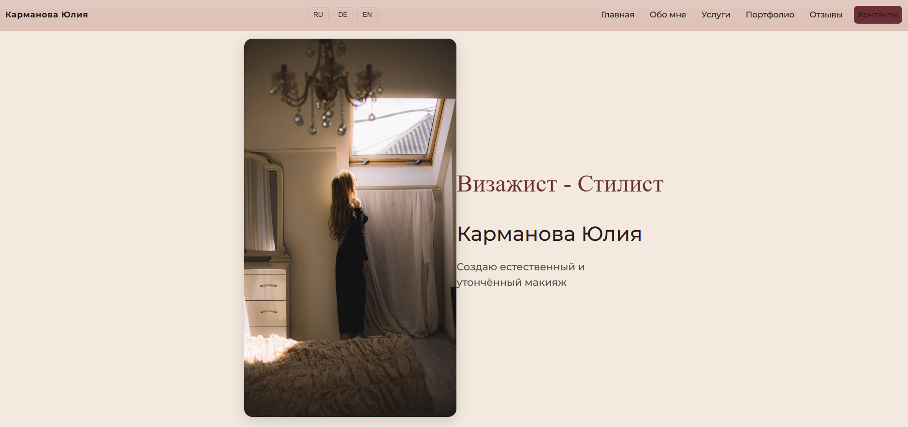
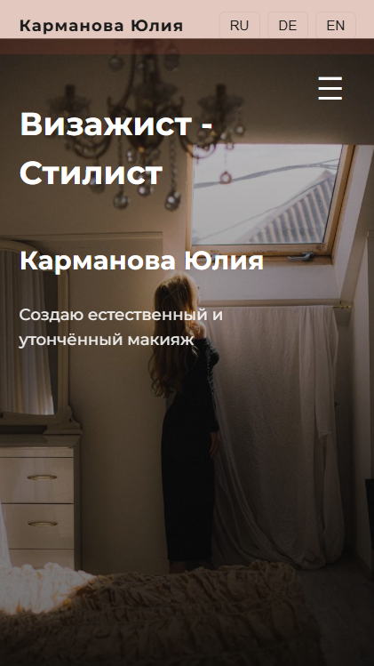

Hallo, ich bin Inna Lobenko -
Junior Frontend Developerin mit Fokus auf modernes Webdesign und Benutzerfreundlichkeit.
Ich entwickle responsive Webseiten, die nicht nur gut aussehen, sondern auch echte Ergebnisse liefern – wie Kundenanfragen und bessere Nutzererfahrung.

### Meine Schwerpunkte
- HTML5, CSS3 (Flexbox, Grid)
- JavaScript (Interaktivität & UI)
- Responsive Design (Mobile First)
- UI/UX & visuelle Gestaltung

### Projekte
    Visagistin Website (Live):  
https://inka-ink.github.io/Karmanova.MakeUp/

### Ziel
Ich suche eine Position als Junior Frontend Developerin, um meine Fähigkeiten in echten Projekten weiterzuentwickeln und Mehrwert für Unternehmen zu schaffen.

Kontakt: offen für Zusammenarbeit - lobenko31@gmail.com 

*** Screenshots

*** Desktop 1

