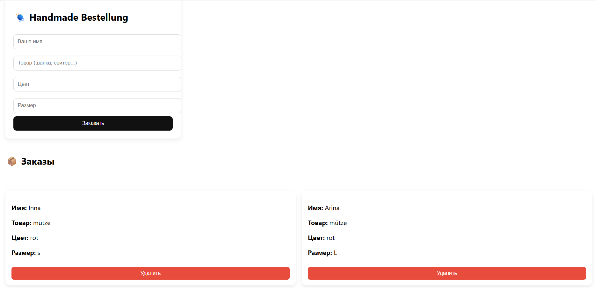
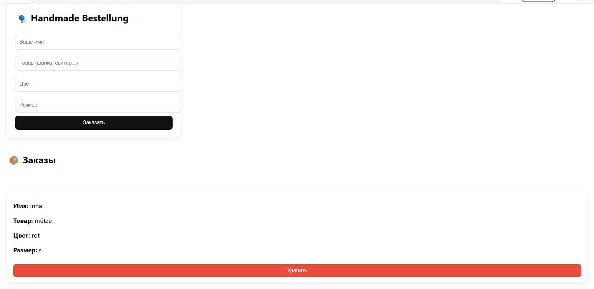

Project in progress.
### Handmade Shop — Bestellverwaltung (Admin-Panel)
###  Admin Login: test@test.com
###  Passwort: 123456

Projektstatus: In Arbeit (In Progress) 

Dies ist das Administrations-Modul für einen Online-Shop für handgemachte Produkte. Das Projekt wurde mit **React** entwickelt und konzentriert sich aktuell auf die Verwaltung von Kundenbestellungen.

###  Aktuelle Funktionen:
* **Bestellformular:** Erfassung von neuen Bestellungen (Name, Artikel, Farbe, Größe).
* **Bestellliste:** Übersichtliche Darstellung aller eingegangenen Aufträge.
* **Datenmanagement:** Funktion zum Löschen von bearbeiteten Bestellungen.

###  Verwendete Technologien:
* **React.js** (Komponenten-basierte Architektur)
* **State Management** (Verwaltung des App-Status)
* **Responsives Design** (Optimiert für verschiedene Bildschirmgrößen)

---
**Geplante Updates:** Integration einer Storefront (Schaufenster) für Kunden und Anbindung einer Datenbank.

